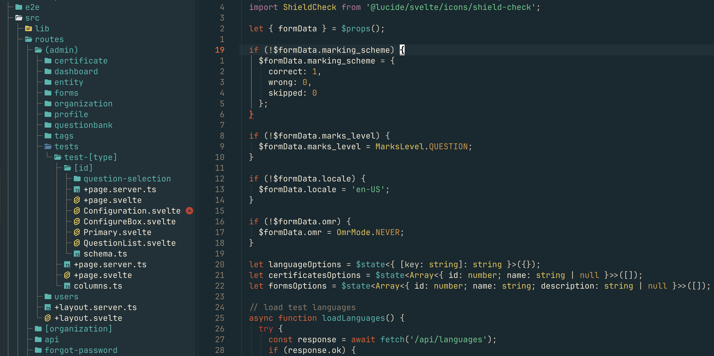
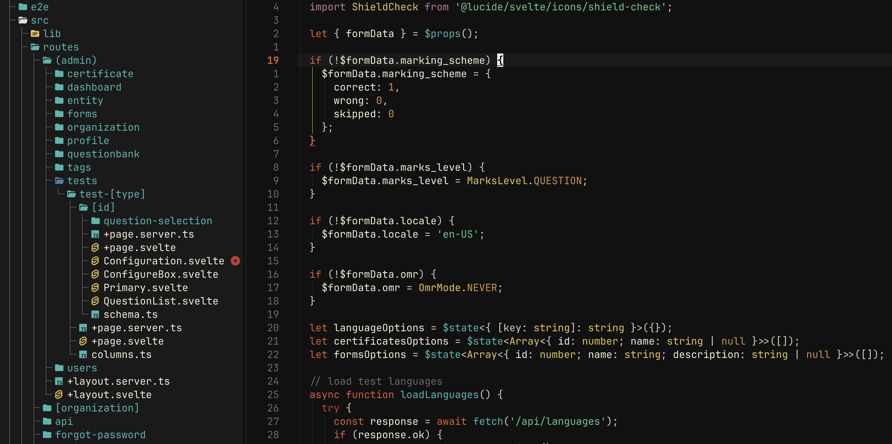

# atomic.nvim

A retro space-age colorscheme for Neovim.

## Screenshots

### Default


### Dark


## Installation

Using [lazy.nvim](https://github.com/folke/lazy.nvim):

```lua
{
  "kurund/atomic.nvim",
  lazy = false,
  priority = 1000,
  config = function()
    vim.cmd.colorscheme("atomic")
  end,
}
```

## Dark Variant

Atomic ships with a dark variant that uses near-black backgrounds (`#111111`) instead of the default blue-teal. Great for OLED displays and high-contrast setups. All accent colors stay the same.

```lua
-- Option 1: Use the colorscheme command directly
vim.cmd.colorscheme("atomic-dark")

-- Option 2: Set the style via setup
require("atomic").setup({ style = "dark" })
vim.cmd.colorscheme("atomic")
```

## Configuration

Configuration is optional. Defaults work out of the box.

```lua
require("atomic").setup({
  -- Theme style: "default" (blue-teal) or "dark" (near-black)
  style = "default",

  -- Override individual palette colors
  palette = {
    bg = "#000000",
  },

  -- Toggle plugin integrations (all enabled by default)
  plugins = {
    telescope = true,
    cmp = true,
    gitsigns = true,
    indent_blankline = true,
    notify = true,
    mini = true,
    lazy = true,
    whichkey = true,
    neotree = true,
    dashboard = true,
  },

  -- Override any highlight group
  overrides = {
    Comment = { italic = false },
  },
})

vim.cmd.colorscheme("atomic")
```

## Supported Plugins

- [telescope.nvim](https://github.com/nvim-telescope/telescope.nvim)
- [nvim-cmp](https://github.com/hrsh7th/nvim-cmp)
- [gitsigns.nvim](https://github.com/lewis6991/gitsigns.nvim)
- [indent-blankline.nvim](https://github.com/lukas-reineke/indent-blankline.nvim)
- [nvim-notify](https://github.com/rcarriga/nvim-notify)
- [mini.nvim](https://github.com/echasnovski/mini.nvim)
- [lazy.nvim](https://github.com/folke/lazy.nvim)
- [which-key.nvim](https://github.com/folke/which-key.nvim)
- [neo-tree.nvim](https://github.com/nvim-neo-tree/neo-tree.nvim)
- [dashboard-nvim](https://github.com/nvimdev/dashboard-nvim)

## Palette

### Default

| Color      | Hex       |
| ---------- | --------- |
| bg         | `#162830` |
| bg_surface | `#1e3038` |
| bg_border  | `#2a3d44` |
| bg_hl      | `#354a52` |
| fg         | `#f5ecd7` |
| fg_dim     | `#d9cdb8` |
| fg_muted   | `#8a7d6b` |
| orange     | `#e05a2d` |
| teal       | `#2fb8b0` |
| green      | `#4dcb8a` |
| yellow     | `#e8c547` |
| red        | `#c9392b` |
| blue       | `#4a7fa5` |
| purple     | `#7b68b0` |
| pink       | `#c47a98` |
| amber      | `#d4953a` |

### Dark

| Color      | Hex       |
| ---------- | --------- |
| bg         | `#111111` |
| bg_surface | `#1a1a1a` |
| bg_border  | `#262626` |
| bg_hl      | `#323232` |
| fg         | `#f5ecd7` |
| fg_dim     | `#d9cdb8` |
| fg_muted   | `#6a6a6a` |

Accent colors are shared across both variants.

## License

MIT
